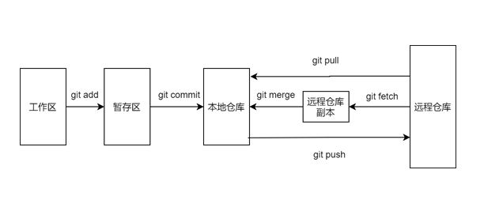

## git 使用总结

### 常用流程

### 常见示例
* 普通模式`--no-ff`合并 和 `fast forward`合并有哪里不同  
普通合并后`git log --graph`有记录，而`fast forward`合并看不出来曾经做过合并
* git cherry-pick 可以在什么场景下使用  
两个分支上同时存在一个bug，在一个分支上将bug修复后进行提交。另一个分支利用`git cherry-pick [commitid]`则可同步修改内容
* git stash 可以在什么场景下使用  
* 多人协作模式